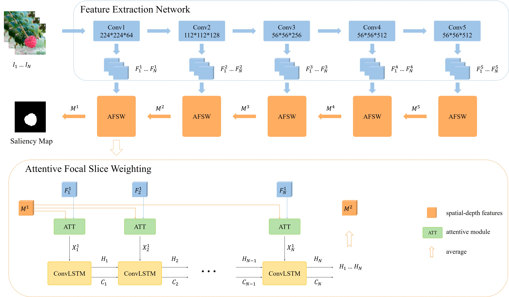
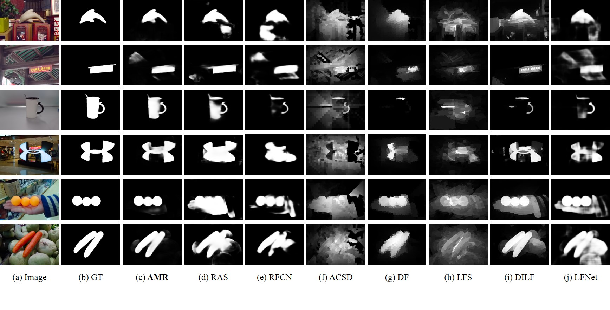

# AMR-for-light-field-saliency
This is the code for the paper "An Attentive Multi-Level Recurrent Network for Salient Object Detection on Light Field".

## Overview of the framework

## Install
Install `pytorch` for training and testing.

## Pre-train
- Prepare the RGB saliency dataset and its data list.
- Use `RGBdata` in [dataset.py](dataset.py) to load RGB saliency dataset for pre-training.

## Fine-tune
- Split the light field saliency dataset to several folds for cross-validation and prepare its corresponding data list. 
- Use `LFdata` in [dataset.py](dataset.py) to load light field saliency dataset for pre-training.

## Models
The fine-turned models of five folods are saved in [parameters](parameters/).

## Test
Run `python test.py` to test. The saliency results of `LF-640` and `LFSD` datasets are in [Results](Results/)

## Results

Visual samples of the comparison results. Note that ‘Image’ is used to represent the scene, instead of the input of our AMR network.
Our AMR network (column (c)) can accurately and completely separate the salient object from the cluttered background in challenging
scenes, for example, when the background is cluttered or has similar appearance with the salient object.
